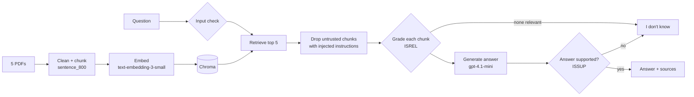

# Milestone 1: Production RAG System

DATA 790 - Henry Halvorsen

A RAG system that answers questions about AI risk management and LLM security, using only five public documents, and cites the document, page, and chunk for every answer. It compares a basic RAG pipeline against a simplified **Self-RAG** pipeline (grades each retrieved chunk, checks the answer is supported, and says "I don't know" instead of guessing).

**Documents:** NIST AI RMF 1.0, NIST AI 600-1 (Generative AI Profile), OWASP Top 10 for LLM Applications 2025, Lewis et al. 2020 (RAG), and Asai et al. 2023 (Self-RAG). 204 pages total.

Everything is in one notebook: `Milestone1_Production_RAG.ipynb`.

## Architecture



The baseline pipeline is just: retrieve top 5 → generate → answer + sources.

## Results

| | Baseline RAG | Self-RAG |
|---|---|---|
| Accuracy (judge score 4-5, 16 answerable questions) | 75% | 75% |
| Faithfulness | 1.00 | 1.00 |
| Said "I don't know" to the 4 unanswerable questions | 3/4 | 2/4 |
| Latency (median) | 2.1 s | 6.8 s |
| Cost per question | $0.00048 | $0.00082 |
| Monthly cost at 10,000 questions/day | $145 | $245 |

Retrieval (sentence_800 chunks, 16 answerable questions): hit@5 = 0.69, precision@1 = 0.38, precision@5 = 0.20. Security: the input filter blocked 14/20 attacks with 1/20 false positives, and Self-RAG declined the other 6. Costs use public OpenAI list prices (the UNC gateway is prepaid).

## How to run

1. Clone the repo and install the requirements (Python 3.10):
   ```
   git clone <repo-url>
   cd <repo-folder>
   pip install -r requirements.txt
   ```
2. Copy `.env.example` to `.env` and put your UNC AI Gateway key in it:
   ```
   cp .env.example .env
   ```
3. Run the whole notebook (downloads the PDFs the first time, then runs every section):
   ```
   jupyter nbconvert --to notebook --execute --inplace Milestone1_Production_RAG.ipynb
   ```
   Or open it in VS Code / Jupyter and click Run All.
4. Every LLM response is saved in `results/llm_cache.json` (embeddings go in `.cache/` on your machine), so rerunning the notebook gives the same numbers without calling the API again. To re-run everything from scratch (a few minutes), delete that file first:
   ```
   rm results/llm_cache.json
   jupyter nbconvert --to notebook --execute --inplace Milestone1_Production_RAG.ipynb
   ```

## Files

- `Milestone1_Production_RAG.ipynb` - the whole system and all the experiments
- `data/eval_questions.json` - 20 golden questions (16 answerable, 4 unanswerable), each with the phrases from the document that contain the answer
- `data/security_tests.json` - 20 prompt injection attacks + 20 normal questions
- `results/llm_cache.json` - every saved LLM response (answer, tokens, latency), so reruns give the same numbers
- `results/generation_eval.csv` - every answer and its judge scores from Section 8
- `requirements.txt`, `.env.example`